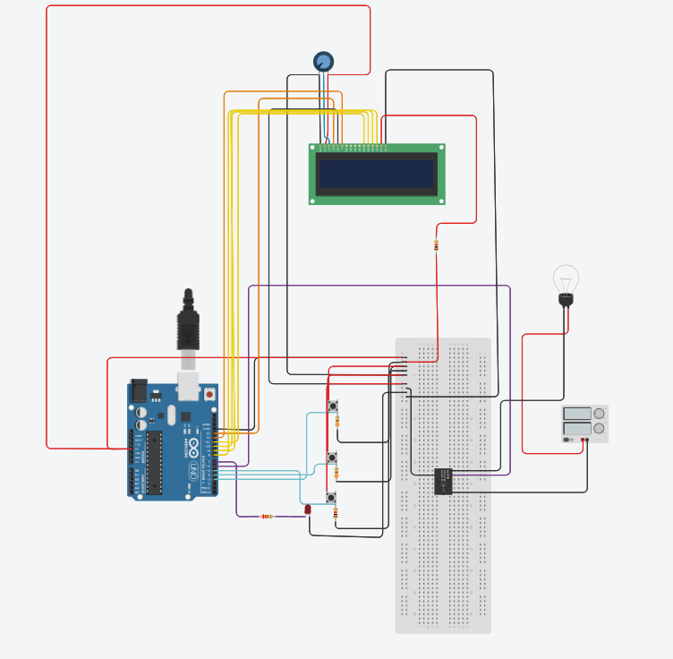

# Phase Failure Detection System for Three-Phase Induction Motors

## Table of Contents

- [Introduction](#introduction)
- [Hardware Components](#hardware-components)
- [Software](#software)
- [Setup Instructions](#setup-instructions)
- [Usage](#usage)
- [Debugging](#debugging)
- [Contributing](#contributing)
- [License](#license)

## Introduction

The Phase Failure Detection System is a project designed to monitor and detect phase failures in three-phase induction motors. It provides real-time feedback on the status of each motor phase using an Arduino, push buttons, an LCD display, and visual indicators. This system is essential for ensuring the reliability and safety of industrial processes that depend on three-phase motors.

## Hardware Components

To build this system, you will need the following hardware components:

- Arduino board (compatible with LiquidCrystal library)
- LiquidCrystal display for visual feedback
- Push buttons (3) to simulate the status of each motor phase
- Relay to trigger external actions in the event of a phase failure
- LED to provide a visual indicator of the system's status
- Wiring and connectors for the connections

## Software

The software for this project is written in Arduino's C/C++ language and uses the LiquidCrystal library for controlling the LCD display. The code can be found in the [code](https://github.com/kimanigitau01/voltage-detection-system.git) directory of this repository.

## Setup Instructions

Follow these steps to set up the Phase Failure Detection System:

1. **Hardware Connection**: Connect the hardware components as specified in the code and wiring diagram.

2. **Upload the Code**: Upload the provided Arduino code (`phase_failure_detection_system.ino`) to your Arduino board using the Arduino IDE.

3. **Serial Monitor (Optional)**: If you have enabled the `TEST_PROTOTYPE` flag in the code, open the Arduino IDE's Serial Monitor to monitor the push button states and calculated voltage state.

4. **Power On**: Power on your system and observe the LCD display for real-time feedback on the status of the motor phases.

## Usage

- The LCD display will show the status of the motor phases: "PHASE FAILURE DETECTION SYSTEM."

- In the event that all phases are working correctly, the display will show "ALL PHASES WORKING," and the relay will be activated while the LED is off.

- If a phase failure is detected, the display will indicate which phase has failed (e.g., "PHASE 1 failed!"), and the relay will deactivate while the LED turns on to signal the failure.

## Debugging

For debugging instructions and tips on resolving issues with the Phase Failure Detection System, please refer to the [Debugging Guide](./debugging.md).

## Contributing

Contributions to this project are welcome. If you have suggestions, improvements, or bug fixes, please open an issue or submit a pull request. Your contributions help make this project better for the community.

## License

This project is open-source and available under the [MIT License](https://github.com/git/git-scm.com/blob/main/MIT-LICENSE.txt). You are free to use, modify, and distribute this project in accordance with the license terms.

---

*Project created by Manasseh Gitau and Peter Nyakoni*

